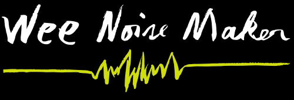
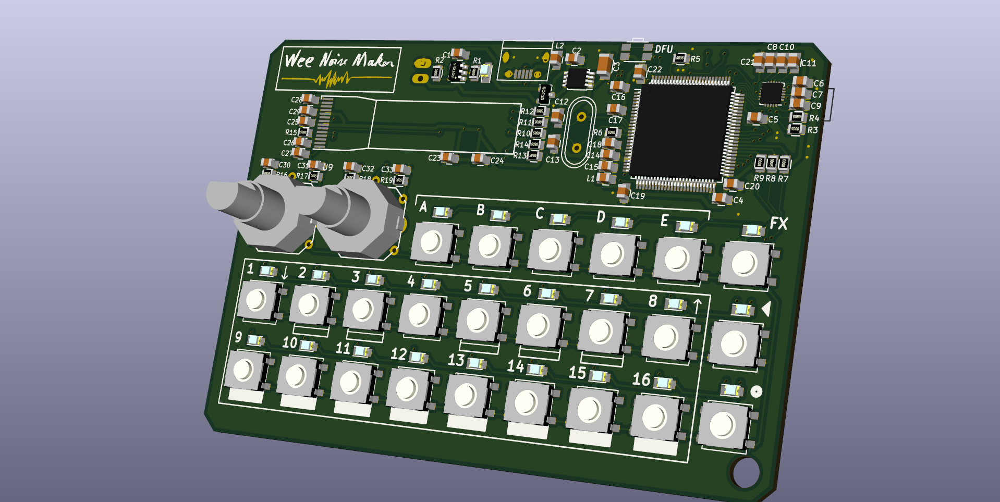

 
# Blog

## 03: Standalone board?

For the second version of the board, my first intent was to do another STM32F4
DISCO daughter board. But then I thought, why not design a standalone board?

Routing and soldering a LQFN100 package seems quite a challenge for me because
I never designed such a complex board and I basically didn't have any
experience with surface mount components. There's also a lot more
components: power supply, audio DAC, decoupling, oscillator, etc.

But who doesn't like a good challenge? So I decided to do the standalone board
and I also to add a battery charging circuit, an SD card and a small OLED
screen for good measure :)

For the audio DAC, I tried to find a component with a friendly package that
doesn't require hot air soldering (like TSOP, LQFN). I found a couple
of those but they don't have headphone amplifier or input ADC so In the
end I went for the SGTL5000 (QFN16), also because it's used on the
Teensy audio board so I have a reference design to start from.

## 02: Switching to Kicad

I designed 4 PCBs before this project, two iterations of a guitar amplifier and
two ATtiny boards for PCB design introduction lessons and also a demo at work.

Those 4 boards I designed with Eagle CAD. Why? I'm not even sure. It
was free (as in beer), available on my platform (Linux) and there was a lot of
tutorials and other resources on the web.

For this project I switched to Kicad. Thanks to Chris Gammell's ["Getting to
blinky 4.0"]
(https://contextualelectronics.com/learning/getting-to-blinky-4-0/) video
series, I was able - in a couple hours - to do as much with Kicad as I was able
to do with Eagle.

Before switching to Kicad, my main concern was the lack of autorouter, but I
quickly realized that up to a certain complexity there's no way around manual
routing. The most difficult part of board layout is to find the right place and
orientation for the components, Eagle's autorouter is not doing that for you.
Also the [push-and-shove](https://www.youtube.com/watch?v=zxHDAHpR5Ls) routing
feature of Kicad really helps.

To this day, my only problem with Kicad is the workflow produced by the
disconnect between the schematics and the PCB layout. I think I understand the
rationale behind it and It's actually very nice to be able to put a resistor in
the schematic without having to make a decision on the package right away. But
in my own experience, designing a board is an iterative process. I go back and
forth between the PCB and the schematic usually to change net names or connect
a button to that MCU pin rather and this one. Having to click 4 or 5 times just
to do that is really not practical. I heard this will change in version 5,
let's see.

Big bonus: 3D render out of the box!

## 01: Quick! Make a PCB!

A few weeks ago I brought a fantastic piece of electronic, the Pocket Operator
Arcade (PO-20) from Teenage Engineering. It's a software synthesizer on
small PCB with a grid of push buttons and LEDs, two potentiometers and a custom
[LCD
screen](https://macprovid.vo.llnwd.net/o43/hub/media/1001/12143/3338900.jpg)
like you would find on a Game & Watch.

Here's a short video that demonstrates the
[features of the PO-20](www.youtube.com/watch?v=W5PvXQq3DVQ).

After playing a [little bit with
it](https://www.youtube.com/watch?v=CN5plqgpwa4), I had a feeling you may know
if you are reading this: I want to make my own! When I start a project like
this one, I jump right in and design a first PCB very quickly while I'm
still in the excitement of this brand new idea. The PCB is of course not very
good (two bodge wires this time) but now I can't go back :)

The first board was designed as daughter board for the STM32F4 DISCO. It has a
powerful microcontroller (Cortex-M4F ~160 Mhz) and an audio DAC with headphone
output, so the "only" thing left to do is the user interface
(buttons and LEDs).

With this board I was able to start working on the software, play with
multiplexed LED and buttons, start a first version of the state machine and get
some sounds out.

But it's time for the second design. I'm a software engineer so
the electronic part of this project is the most challenging and interesting for
me.
